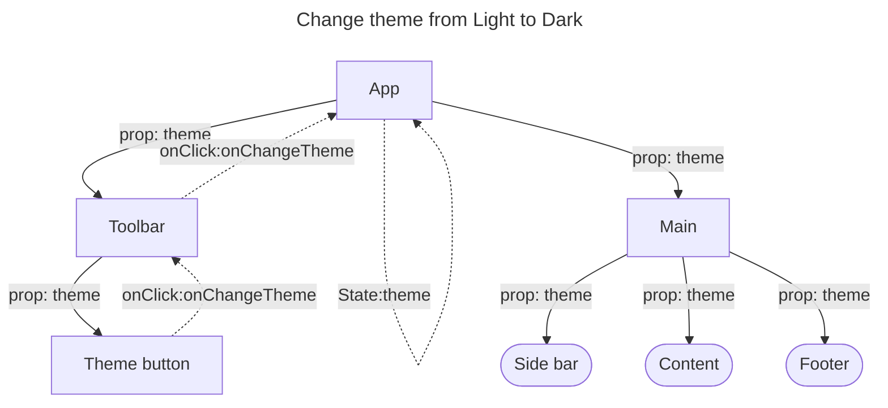

# Thinking

为什么目前主流框架像 React、Vue 和 Angular 都要用 prop 来传递数据？

<v-click>

**维持单向数据流，让组件之间的关系变得简单且可预测。**

</v-click>

 

<v-click>

</v-click>

<v-click>

 *如何解决这种情况？共有哪些方式？*

</v-click>

<!--
这里有一道思考题，为什么 React、Vue 和 Angular 三大主流框架都要用 prop 和事件来传递数据？

简单给大家两分钟时间思考下；

OK，那我现在公布答案哈，（click）为什么呢？因为要维持单向数据流，大家都知道，实际我们最终渲染的页面是树形结构，树形结构就会有根节点和叶子节点，
那么这个单向数据流的方向是从组件根节点流向叶子节点，且为单向，也就是不允许数据从叶子节点传递到父节点。

那么这种单向数据流的好处对于 React 来说，就是让组件之间的关系简单纯净，同时对于组件的变化是可预测的，因为能影响到子组件变化的只能是父组件传给他的 props。
那么对于 Angular 来说，实际上还有其他的好处，大家有兴趣的话可以去了解下。

下面给大家看个图，对于大家的理解可能比较直观：
  
这是一个我们自己构造的组件树，以改变主题为例。

根节点是 App 组件，它里面有 Toolbar 和 Main 组件，Toolbar 组件下有一个 ThemeButton 组件，这个组件主要是用来改变当前主题的。

Main 组件下面的子组件都会根据传入的 theme 属性来变更当前的显示主题，也就是说 Main 组件会透传 theme prop 但是不会消费它，而 Side bar、Content 和 Footer 组件会消费 theme prop。

大家可以看下黄实线，除 App 组件外，每个组件都接受一个 prop 为 theme，那么数据流向就是自上而下的，而且组件之间的依赖关系一目了然。

当我们改变主题时，从 ThemeButton 组件触发 onClick 事件，类似于事件冒泡，将 changeTheme 这个事件传递到 App 组件，在其组件内部我们更新 theme 状态变量。

那么除了 App 组件外所有的子组件的 theme 属性都会被更新，数据再一次单向地从根组件流向到叶子组件。

OK，大家会发现，实际上只有 Sidebar, Content 和 Footer 会消费 theme prop，而且目前我们的结构很简单，如果 Main 组件下有很多层，透传属性就变得十分的繁琐了。

那么有什么好的办法呢？这个留给大家在会后自行了解。

今天的分享就到这里了，谢谢大家
 -->
